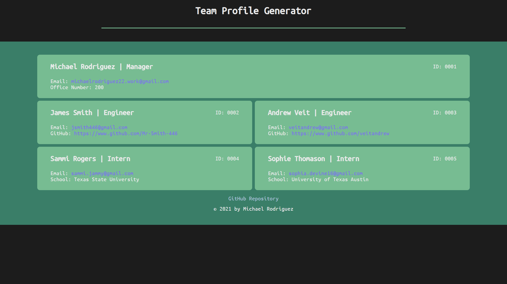

# Team Profile Generator

## Table of Contents

- [Directory Structure](#Directory-Structure)
- [Installation & Usage](#Installation-&-Usage)
- [Demo Video](#Demo-Video)
- [Sample Page](#Sample-Page)
- [Acceptance Criteria](#Acceptance-Criteria)

---

## Directory Structure

```
__tests__/              <!-- jest unit tests -->
  Employee.test.js
  Engineer.test.js
  Intern.test.js
  Manager.test.js

dist/                   <!-- rendered output (html), stylesheet -->
  index.html
  style.css

lib/                    <!-- classes -->
  Employee.js
  Engineer.js
  index.js
  Intern.js
  Manager.js

node_modules/           <!-- dependencies -->

sample                  <!-- sample html file -->
  index.html
  screenshot.png

src/                    <!-- modular js logic -->
  format-data.js
  index.js
  page-template.js
  prompts.js

.gitignore
index.js                // entry point & file generation
package-lock.json
package.json
README.md

```

---

## Installation & Usage

You will need to have Node installed on your computer. Begin by cloning this repository to your local machine. Once you have done that, navigate to the root directory of the project in your terminal and run the following commands:

```
<!-- install dependencies -->

npm install

<!-- start app -->

npm start       <!-- node index will also work -->
```

---

## Demo Video

<a href="" target="_blank">https://www.youtube.com/watch?v=Z0r2YB6fEMI</a>

---

## Sample Page



---

## Acceptance Criteria

```
GIVEN a command-line application that accepts user input
WHEN I am prompted for my team members and their information
THEN an HTML file is generated that displays a nicely formatted team roster based on user input
WHEN I click on an email address in the HTML
THEN my default email program opens and populates the TO field of the email with the address
WHEN I click on the GitHub username
THEN that GitHub profile opens in a new tab
WHEN I start the application
THEN I am prompted to enter the team manager’s name, employee ID, email address, and office number
WHEN I enter the team manager’s name, employee ID, email address, and office number
THEN I am presented with a menu with the option to add an engineer or an intern or to finish building my team
WHEN I select the engineer option
THEN I am prompted to enter the engineer’s name, ID, email, and GitHub username, and I am taken back to the menu
WHEN I select the intern option
THEN I am prompted to enter the intern’s name, ID, email, and school, and I am taken back to the menu
WHEN I decide to finish building my team
THEN I exit the application, and the HTML is generated
```
